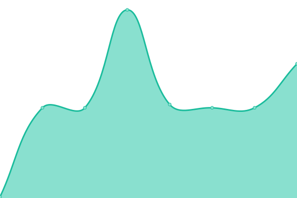
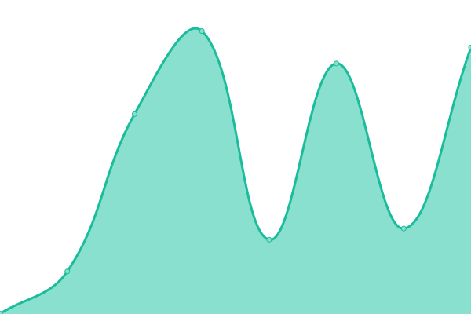

# [📈 Live Status](https://JiangWeixian.github.io/upptime): <!--live status--> **🟩 All systems operational**

This repository contains the open-source uptime monitor and status page for [JW](jwx.ink), powered by [Upptime](https://github.com/upptime/upptime).

With [Upptime](https://upptime.js.org), you can get your own unlimited and free uptime monitor and status page, powered entirely by a GitHub repository. We use [Issues](https://github.com/JiangWeixian/upptime/issues) as incident reports, [Actions](https://github.com/JiangWeixian/upptime/actions) as uptime monitors, and [Pages](https://upptime.js.org) for the status page.

<!--start: status pages-->
<!-- This summary is generated by Upptime (https://github.com/upptime/upptime) -->
<!-- Do not edit this manually, your changes will be overwritten -->
<!-- prettier-ignore -->
| URL | Status | History | Response Time | Uptime |
| --- | ------ | ------- | ------------- | ------ |
|  [Google](https://www.google.com) | 🟩 Up | [google.yml](https://github.com/JiangWeixian/upptime/commits/HEAD/history/google.yml) | 

 82ms
     
 | 

<a href="https://JiangWeixian.github.io/upptime/history/google">100.00%</a>
    

|  [Realme-Webgradients-API](https://realme-ten.vercel.app/api/v1/webgradients.svg?desc=happy%20hacking&radialgradiets=true&subtitle=indiehackers&title=hello%20world&webgradientsName=FrozenDreams) | 🟩 Up | [realme-webgradients-api.yml](https://github.com/JiangWeixian/upptime/commits/HEAD/history/realme-webgradients-api.yml) | 

 1363ms
     
 | 

<a href="https://JiangWeixian.github.io/upptime/history/realme-webgradients-api">100.00%</a>
    

|  [Blog](https://jwx.ink) | 🟩 Up | [blog.yml](https://github.com/JiangWeixian/upptime/commits/HEAD/history/blog.yml) | 

 533ms
     
 | 

<a href="https://JiangWeixian.github.io/upptime/history/blog">100.00%</a>
    

<!--end: status pages-->

[**Visit our status website →**](https://upptime.js.org)

## 📄 License

- Powered by: [Upptime](https://github.com/upptime/upptime)
- Code: [MIT](./LICENSE) © [JW](jwx.ink)
- Data in the `./history` directory: [Open Database License](https://opendatacommons.org/licenses/odbl/1-0/)
